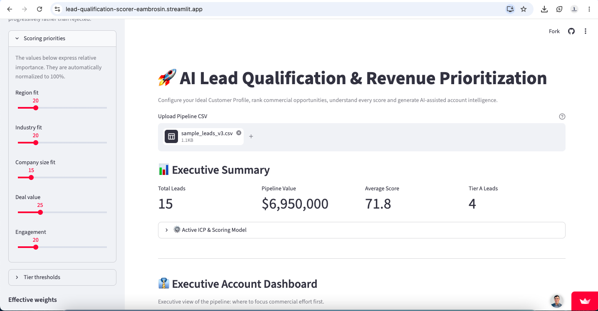
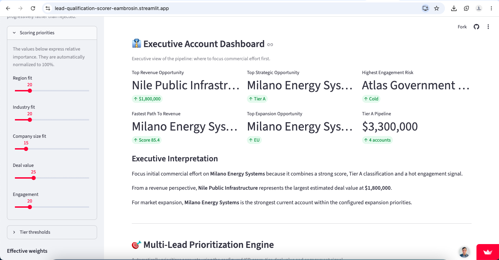
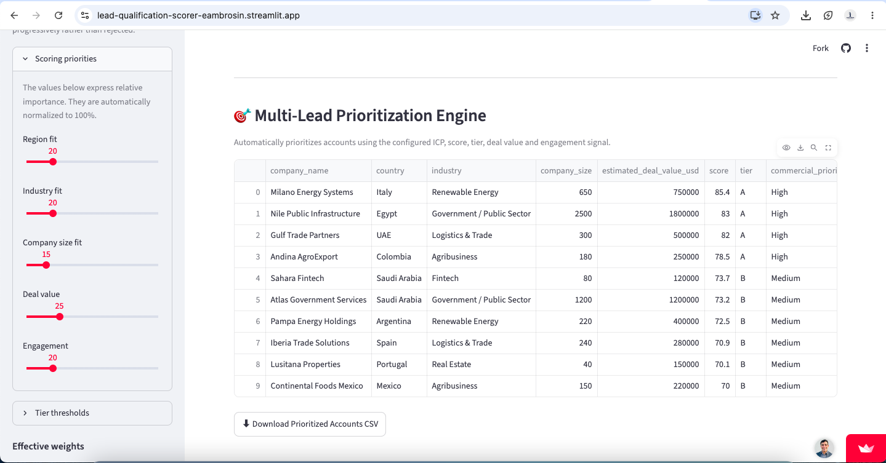
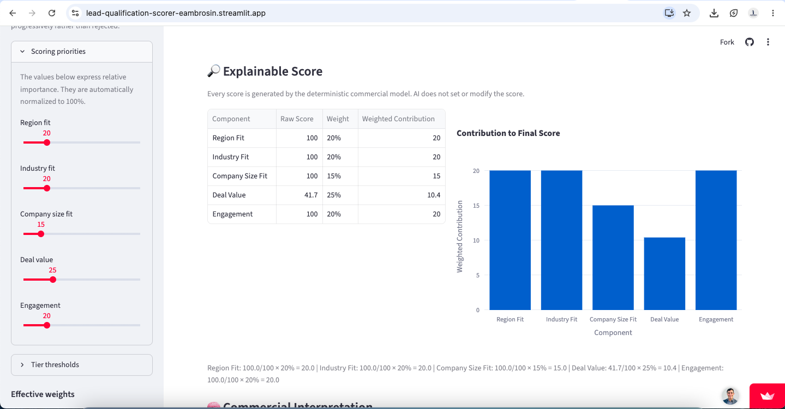
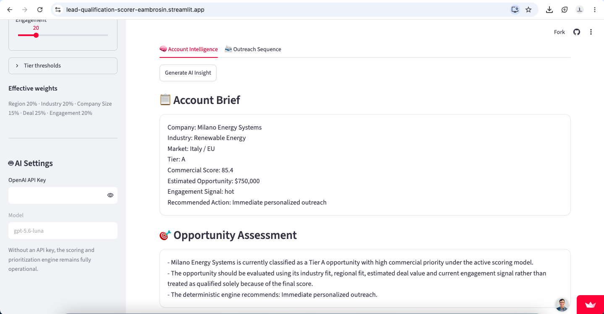

# Lead Qualification & Revenue Prioritization Platform

### Configurable ICP Scoring | Explainable Commercial Intelligence | Revenue Prioritization | AI-Assisted Account Strategy

[](https://lead-qualification-scorer-eambrosin.streamlit.app/)


A practical Commercial Intelligence application designed to help Business Development, Sales, Partnerships and GTM teams determine **which opportunities deserve attention, why they matter and what commercial action should happen next**.

The platform combines a transparent deterministic scoring engine with an optional AI intelligence layer.

**AI does not determine the lead score.**

Commercial scores, tiers and prioritization are calculated using configurable business rules. AI is used afterward to interpret those results, support account strategy and assist commercial execution.

---

# Role in the Commercial Intelligence Ecosystem

This application represents the **PRIORITIZE** stage of the broader AI Business Development Toolkit.

```text
IDENTIFY
Opportunity Discovery

        ↓

PRIORITIZE
Lead Qualification & Revenue Prioritization
← YOU ARE HERE

        ↓

ENGAGE
Adaptive Outreach Intelligence

        ↓

PARTNER
Partnership Opportunity Intelligence

        ↓

EXPAND
Global Market Entry Intelligence
```

The objective is to convert raw commercial pipeline data into a structured decision layer before commercial resources are allocated.

---

## 🚀 Live Application

[Launch the Lead Qualification & Revenue Prioritization Platform](https://lead-qualification-scorer-eambrosin.streamlit.app/)

---

# Product Preview

## Executive Commercial Intelligence



Configure the Ideal Customer Profile, preferred company size and scoring priorities before evaluating the commercial pipeline.

---

## Executive Account Dashboard



Identify high-value opportunities, strategic priorities, expansion opportunities, engagement risks and the accounts that deserve immediate commercial attention.

---

## Multi-Lead Prioritization Engine



Rank the commercial pipeline using the active ICP, transparent scoring logic, company-size fit and recommended commercial actions.

---

## Explainable Commercial Scoring



Understand exactly how **Region Fit, Industry Fit, Company Size Fit, Deal Value and Engagement** contribute to the final commercial score.

---

## AI-Assisted Account Intelligence



Use deterministic qualification results as context for AI-assisted account interpretation, GTM recommendations, discovery questions and commercial next steps.

---

# Business Problem

Commercial teams frequently manage more accounts and opportunities than they can effectively pursue.

Raw lead lists rarely answer the questions that matter most:

- Which accounts deserve immediate attention?
- Which opportunities best match our Ideal Customer Profile?
- Where should commercial resources be allocated?
- Why did one account rank higher than another?
- Which opportunities represent meaningful revenue potential?
- Which accounts require more qualification?
- What should the next Business Development action be?

Without a structured prioritization layer, commercial teams risk spending equal effort on opportunities with very different levels of relevance and value.

---

# Solution

Users define their Ideal Customer Profile, configure commercial priorities and upload a pipeline.

The system then:

1. Evaluates every account against the active ICP.
2. Calculates a transparent commercial score.
3. Assigns each opportunity to a priority tier.
4. Explains exactly how the score was calculated.
5. Recommends the next commercial action.
6. Ranks the complete opportunity pipeline.
7. Provides executive pipeline visibility.
8. Exports the prioritized pipeline.
9. Optionally generates AI-assisted account intelligence.
10. Can pass qualification context directly into the Adaptive Outreach Intelligence Platform.

---

# Commercial Intelligence Workflow

## ICP → Score → Explain → Prioritize → Act

```text
PIPELINE
    ↓
ICP CONFIGURATION
    ↓
COMMERCIAL EVALUATION
    ↓
EXPLAINABLE SCORE
    ↓
PRIORITY TIER
    ↓
RECOMMENDED ACTION
    ↓
PIPELINE PRIORITIZATION
    ↓
COMMERCIAL EXECUTION
```

The application is designed around one central question:

> **Where should the commercial team spend time first?**

---

# 🎯 Configurable Ideal Customer Profile

Version 2.0 allows users to define what a commercially attractive opportunity looks like.

The active ICP can include:

- Priority Regions
- Priority Industries
- Preferred Company Size
- Relative importance of each scoring factor
- Tier thresholds

This allows the same application to support different commercial strategies without changing the underlying code.

---

## Priority Regions

Examples include:

```text
LATAM
MENA
Europe
North America
APAC
Africa
```

Selected target regions receive the strongest Region Fit score.

Other markets remain eligible but may receive lower relative scores according to the configured model.

---

## Priority Industries

Examples include:

```text
Agribusiness
Renewable Energy
Government / Public Sector
Fintech
Real Estate
Logistics & Trade
```

This allows the scoring model to reflect actual commercial focus rather than assuming every sector has equal relevance.

---

## Preferred Company Size

Users can define a preferred employee range.

Example:

```text
Minimum Employees: 50
Maximum Employees: 1,000
```

Companies inside the preferred range receive the strongest Company Size Fit.

Companies outside the range are progressively penalized rather than automatically rejected.

This avoids the simplistic assumption that a larger company is always a better commercial opportunity.

---

# ⚖️ Configurable Scoring Model

The default v2.0 model evaluates five commercial dimensions.

| Component | Default Weight |
|---|---:|
| Region Fit | 20% |
| Industry Fit | 20% |
| Company Size Fit | 15% |
| Deal Value | 25% |
| Engagement | 20% |

Users can change the relative importance of each factor directly from the Streamlit interface.

Weights are automatically normalized to 100%.

---

# 🔎 Explainable Commercial Scoring

Every final score can be audited.

Example:

```text
Region Fit          100/100 × 20% = 20.0
Industry Fit        100/100 × 20% = 20.0
Company Size Fit     85/100 × 15% = 12.8
Deal Value           72/100 × 25% = 18.0
Engagement          100/100 × 20% = 20.0

Final Score                         90.8
```

The engine stores both:

```text
Raw Component Scores
        +
Weighted Contributions
        =
Final Commercial Score
```

This makes the qualification process transparent instead of relying on a black-box AI score.

---

# Priority Tiers

The default classification model is:

```text
Tier A = 75+
Tier B = 50–74
Tier C = Below 50
```

Tier thresholds can also be configured directly from the application.

---

## Tier A

High-priority commercial opportunities.

These accounts generally justify concentrated Business Development attention.

---

## Tier B

Commercially relevant opportunities that may require additional qualification, research or nurturing.

---

## Tier C

Lower-priority accounts where commercial resources should be allocated selectively.

---

# 🚀 Recommended Commercial Actions

The scoring engine translates qualification results into practical Business Development recommendations.

Examples include:

```text
Immediate Personalized Outreach

High-Priority Outreach with Account Research

Priority Follow-Up and Qualification

Nurture and Continue Qualification

Validate Strategic Fit Before Allocating Resources

Low-Priority Nurture
```

The objective is to move beyond scoring and answer:

> **What should the commercial team do next?**

---

# 👔 Executive Account Dashboard

The application provides an executive view of the commercial pipeline.

Metrics and recommendations can include:

- Total Leads
- Total Pipeline Value
- Average Commercial Score
- Tier A Opportunities
- Tier A Pipeline Value
- Top Revenue Opportunity
- Fastest Path to Revenue
- Top Strategic Opportunity
- Top Expansion Opportunity
- Highest Engagement Risk

This allows the application to operate as a lightweight **Commercial Intelligence layer**, rather than simply a lead-scoring calculator.

---

# 🎯 Multi-Lead Prioritization Engine

The complete pipeline is automatically ranked according to the active ICP.

For each account, the platform can display:

- Company
- Country
- Region
- Industry
- Company Size
- Estimated Deal Value
- Engagement Signal
- Commercial Score
- Priority Tier
- Recommended Action

The result is a prioritized commercial pipeline designed to support resource allocation.

---

# 🧩 Lead Intelligence Workspace

Users can select individual accounts and inspect their commercial context.

## Company Profile

- Company
- Country
- Region
- Industry
- Company Size

## Revenue Potential

- Estimated Deal Value
- Commercial Score
- Priority Tier
- Engagement Signal

## Recommended Action

The deterministic engine proposes the appropriate commercial motion based on the qualification result.

## Explainable Score

A component-by-component breakdown shows exactly how the final score was constructed.

---

# 🤖 AI-Assisted Account Intelligence

The AI layer receives the deterministic qualification result as context.

This can include:

- Commercial Score
- Priority Tier
- Score Rationale
- Score Breakdown
- Recommended Action
- Priority Regions
- Priority Industries
- Preferred Company Size
- Scoring Weights
- Tier Thresholds

The AI is explicitly instructed **not to replace or modify the deterministic score**.

Instead, it provides qualitative commercial interpretation.

---

## AI Account Intelligence

The system can generate:

- Account Brief
- Opportunity Assessment
- Score Interpretation
- Recommended GTM Angle
- Discovery Questions
- Next Best Action

This allows the qualification engine to answer not only:

> **How attractive is this account?**

but also:

> **How should the commercial team interpret and approach it?**

---

# ✉️ Embedded AI Outreach Assistance

The application also includes lightweight account-level outreach assistance.

It can generate:

- Opportunity Hypothesis
- Email Subject
- Consultative Email
- LinkedIn Message
- Call Opener
- Discovery Questions
- Recommended Next Step

Internal scoring information is not exposed to prospects.

---

# Important Distinction: Embedded Outreach vs Adaptive Outreach Platform

The lightweight outreach capability inside this application is designed to assist with **individual account execution**.

It is different from the standalone:

## Adaptive Outreach Intelligence Platform

The downstream Outreach platform provides pipeline-level functionality including:

- Commercial Intelligence Mode
- Adaptive priority
- Dynamic cadence
- Channel strategy
- Multilingual communication
- Prospecting workflows
- Post-Proposal workflows
- Revenue At Risk visibility
- Commercial Decision Support
- Adaptive sequence generation

The Lead Qualification Platform determines:

```text
WHO DESERVES ATTENTION
```

The Adaptive Outreach Platform determines:

```text
HOW AND WHEN TO ENGAGE
```

---

# 🔗 Integration with Adaptive Outreach Intelligence

The two applications are designed to work together.

The Lead Qualification Platform can export a prioritized commercial pipeline that is directly consumed by the Adaptive Outreach Intelligence Platform.

The integrated workflow is:

```text
LEAD QUALIFICATION
        ↓
ICP FIT
        ↓
COMMERCIAL SCORE
        ↓
PRIORITY TIER
        ↓
RECOMMENDED ACTION
        ↓
CSV EXPORT
        ↓
ADAPTIVE OUTREACH INTELLIGENCE
        ↓
OUTREACH PRIORITY
        ↓
CADENCE
        ↓
CHANNEL
        ↓
COMMERCIAL MESSAGE
```

This preserves qualification context between analysis and execution.

---

## Data Handoff

Typical exported fields include:

```text
company_name
country
region
industry
company_size
estimated_deal_value_usd
engagement_signal
score
tier
recommended_action
score_rationale
```

The Outreach platform automatically detects this information and activates:

```text
Commercial Intelligence Mode
```

---

## Adaptive Outreach Intelligence Platform

### Live Application

[Launch Adaptive Outreach Intelligence](https://outreach-sequence-generator-7dcmglcxfnmszlodg8lqre.streamlit.app/)

### Repository

[View Repository](https://github.com/Eambrosin/outreach-sequence-generator)

---

# 🛡️ Evidence-Aware AI Design

The AI layer is instructed not to fabricate:

- Company initiatives
- Financial information
- Decision makers
- Market research
- Expansion plans
- Business problems
- Internal projects
- Unverified strategic priorities

Unverified commercial ideas should be treated as:

```text
Hypotheses
Questions
Areas to Validate
```

rather than facts.

This keeps the AI layer aligned with practical and responsible Business Development workflows.

---

# Internal vs External Commercial Information

The platform explicitly separates internal qualification information from prospect-facing communication.

## Internal

```text
Commercial Score
Priority Tier
Score Rationale
Score Breakdown
ICP Configuration
Recommended Action
Commercial Ranking
```

## External

```text
Relevant Business Context
Commercial Question
Value Proposition
Discovery Question
CTA
Recommended Next Step
```

A prospect should never receive statements such as:

```text
Your score is 88.

You are classified as Tier A.

You are a High Priority account.
```

---

# 🔄 AI-Optional Architecture

The deterministic qualification engine works without an API key.

Without AI access, the platform still provides:

- ICP Configuration
- Region Fit
- Industry Fit
- Company Size Fit
- Deal Value assessment
- Engagement scoring
- Lead Scoring
- Tier Classification
- Explainable Scoring
- Revenue Prioritization
- Recommended Actions
- Executive Dashboard
- Pipeline Ranking
- CSV Export

AI enhances the platform but does not control the core qualification workflow.

---

# Architecture Principle

The system follows a simple architectural rule:

> **Use structured commercial logic to decide what matters, then use AI to help humans understand and act on that decision.**

The deterministic engine remains the source of truth for:

```text
Scores
Thresholds
Priority
Ranking
Tier Classification
Commercial Qualification
```

AI can support:

```text
Interpretation
Commercial Hypotheses
Account Intelligence
GTM Recommendations
Discovery Questions
Outreach Drafting
Next-Step Suggestions
```

---

# 📊 Sample Dataset

The repository includes a demonstration pipeline:

```text
data/sample_leads.csv
```

The dataset contains accounts across multiple markets including:

- LATAM
- Europe
- MENA
- APAC

and sectors including:

- Renewable Energy
- Agribusiness
- Fintech
- Government / Public Sector
- Logistics & Trade
- Real Estate

The sample intentionally includes different company sizes, deal values and engagement signals so users can test how ICP changes affect prioritization.

---

# CSV Format

Recommended columns:

```text
company_name
country
region
industry
company_size
estimated_deal_value_usd
engagement_signal
```

Example:

```csv
company_name,country,region,industry,company_size,estimated_deal_value_usd,engagement_signal
Andina AgroExport,Colombia,LATAM,Agribusiness,180,250000,hot
Solis Renewables,Brazil,LATAM,Renewable Energy,90,180000,warm
Gulf Trade Partners,UAE,MENA,Logistics & Trade,300,500000,hot
```

`company_size` is recommended for the complete v2.0 ICP model.

The application can still process pipelines where company-size information is unavailable.

---

# System Architecture

```text
Pipeline CSV
      ↓
ICP Configuration
      ↓
Deterministic Scoring Engine
      ↓
Commercial Score
      ↓
Priority Tier
      ↓
Explainable Score Breakdown
      ↓
Recommended Commercial Action
      ↓
Executive Prioritization
      ↓
Optional AI Interpretation
      ↓
Account Intelligence
      ↓
CSV Export
      ↓
Adaptive Outreach Intelligence
```

The deterministic engine remains the source of truth for commercial qualification.

---

# Project Structure

```text
lead-qualification-scorer/
│
├── app.py
├── lead_qualifier.py
├── ai_insights.py
├── requirements.txt
├── README.md
├── .gitignore
│
├── data/
│   └── sample_leads.csv
│
├── exports/
│
└── screenshots/
    ├── v2-executive-summary.png
    ├── v2-executive-dashboard.png
    ├── v2-prioritization-engine.png
    ├── v2-explainable-score.png
    └── v2-ai-intelligence.png
```

---

## `lead_qualifier.py`

Deterministic Commercial Intelligence engine responsible for:

- ICP scoring
- Region Fit
- Industry Fit
- Company Size Fit
- Deal Value scoring
- Engagement scoring
- Weighting
- Tier classification
- Score explainability
- Recommended commercial actions
- Pipeline ranking

---

## `app.py`

Streamlit interface responsible for:

- ICP configuration
- Pipeline upload
- Executive dashboards
- Lead prioritization
- Explainable scoring
- Account workspace
- AI workflow
- CSV export

---

## `ai_insights.py`

Optional qualitative intelligence layer responsible for:

- Account interpretation
- Opportunity assessment
- Score interpretation
- GTM recommendations
- Discovery questions
- Outreach assistance

---

# Technology Stack

- Python
- Streamlit
- Pandas
- Plotly
- OpenAI SDK
- Rule-Based Commercial Intelligence
- AI-Assisted Workflows

---

# Run Locally

Clone the repository:

```bash
git clone https://github.com/Eambrosin/lead-qualification-scorer.git
```

Enter the project:

```bash
cd lead-qualification-scorer
```

Create a virtual environment:

```bash
python3 -m venv venv
```

Activate it:

```bash
source venv/bin/activate
```

Install dependencies:

```bash
pip install -r requirements.txt
```

Run the application:

```bash
streamlit run app.py
```

---

# Optional OpenAI Configuration

The application works without an API key.

To enable AI-assisted Account Intelligence and lightweight Outreach assistance, provide an OpenAI API key through the application interface or environment configuration.

The deterministic scoring engine remains independent from the AI layer.

---

# v2.0.0 Highlights

Version 2.0 represents the transition from a fixed lead-scoring application into a configurable Commercial Intelligence system.

## Added

- Configurable Ideal Customer Profile
- Priority Region selection
- Priority Industry selection
- Preferred Company Size range
- Five-factor commercial scoring
- Adjustable scoring priorities
- Automatic weight normalization
- Configurable Tier thresholds
- Company Size Fit
- Explainable score breakdown
- Recommended commercial actions
- Active ICP visualization
- Expanded demonstration dataset
- AI context integration
- Evidence-aware AI prompts
- Outreach guardrails
- Local non-API fallback
- Improved executive dashboard
- Prioritized CSV export
- Direct interoperability with Adaptive Outreach Intelligence
- Product screenshots
- Public v2.0.0 release

---

# Commercial Intelligence Ecosystem

This application forms part of the broader:

## AI Business Development Toolkit

[View Central Toolkit](https://github.com/Eambrosin/AI-Business-Development-Toolkit)

The ecosystem follows:

```text
IDENTIFY
Opportunity Discovery

        ↓

PRIORITIZE
Lead Qualification & Revenue Prioritization
← THIS APPLICATION

        ↓

ENGAGE
Adaptive Outreach Intelligence

        ↓

PARTNER
Partnership Opportunity Intelligence

        ↓

EXPAND
Global Market Entry Intelligence
```

---

# Current Ecosystem Status

```text
PRIORITIZE
Lead Qualification & Revenue Prioritization
v2.0.0
✅ SHIPPED

ENGAGE
Adaptive Outreach Intelligence
v2.0.0
✅ SHIPPED

PARTNER
Partnership Opportunity Finder
✅ SHIPPED / IMPROVING

EXPAND
Global Market Entry Intelligence
🚧 IN DEVELOPMENT

IDENTIFY
Opportunity Discovery Intelligence
📋 PLANNED
```

---

# Roadmap

Potential future development areas include:

- CRM integrations
- HubSpot workflow
- Salesforce workflow
- Apollo / Clay enrichment
- Contact and stakeholder intelligence
- Buying-signal enrichment
- Territory planning
- Historical opportunity tracking
- Conversion analytics
- ICP presets
- Account comparison
- Commercial scenario simulation
- Scoring-performance analysis
- Conversion feedback loops
- Direct Outreach handoff
- Shared account identifiers across products
- Unified Commercial Intelligence dashboard

The long-term direction is to create a connected Commercial Intelligence workflow covering:

```text
Identify → Prioritize → Engage → Partner → Expand
```

---

# Business Use Case

This project demonstrates how deterministic Commercial Intelligence and AI can work together to improve practical Business Development execution.

The application is designed around a simple principle:

> **Use structured commercial logic to decide what matters, then use AI to help humans act on that decision.**

---

# Portfolio Positioning

This is not a generic chatbot or AI demonstration.

It is a practical Commercial Intelligence application focused on:

- International Business Development
- Lead Qualification
- Revenue Prioritization
- Strategic Partnerships
- GTM Strategy
- Revenue Operations
- Market Expansion
- Explainable Commercial Scoring
- AI-Assisted Commercial Decision-Making

It forms part of the broader **AI Business Development Toolkit** developed by Eduardo Ambrosin.

---

# Author

**Eduardo Ambrosin**

International Business Development · GTM · Strategic Partnerships · Commercial Intelligence · AI-Assisted Systems

[GitHub](https://github.com/Eambrosin)

[Professional Website](https://www.ambrosinlegaltrade.com/)

[LinkedIn](https://www.linkedin.com/in/eduardoambrosin/)
