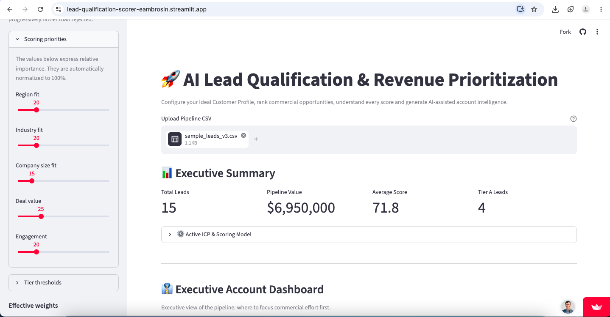
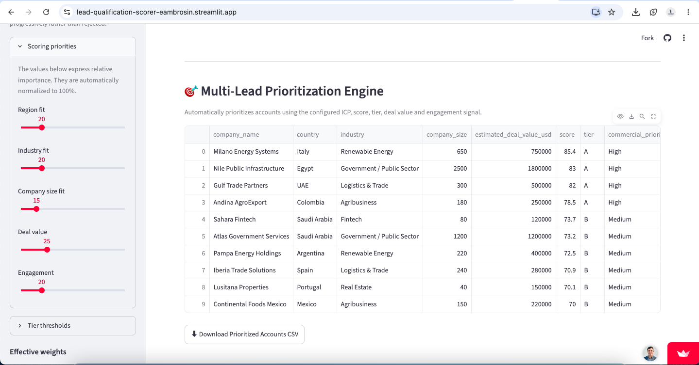
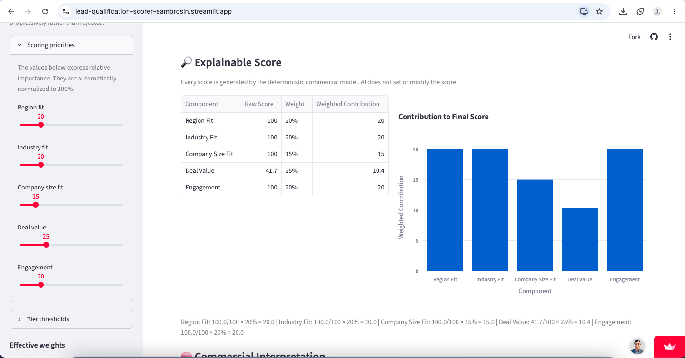
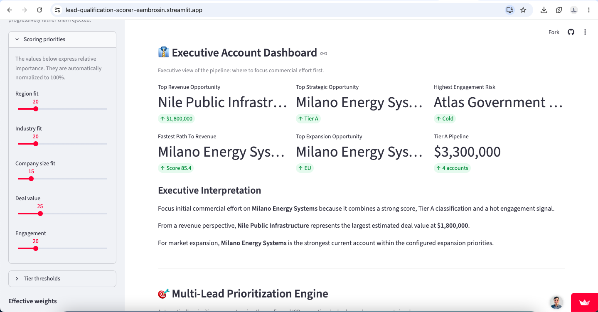
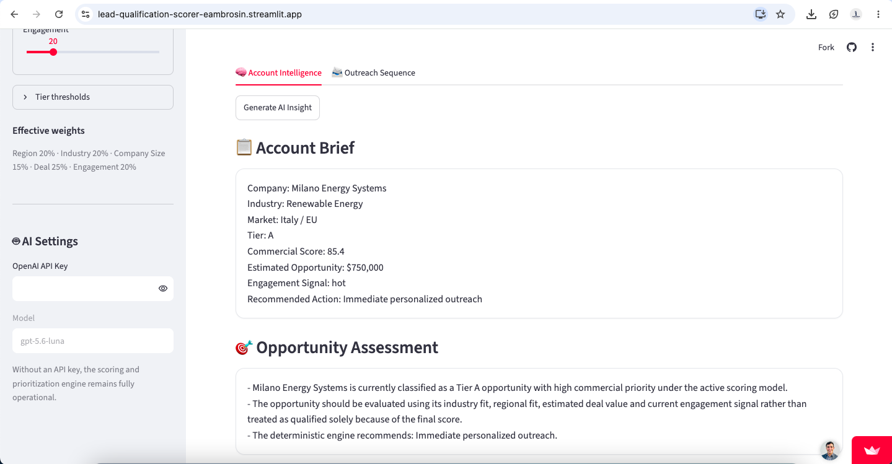

# Lead Qualification & Revenue Prioritization Platform

### Configurable ICP Scoring | Explainable Commercial Intelligence | Revenue Prioritization

[](https://lead-qualification-scorer-eambrosin.streamlit.app/)


[](https://github.com/Eambrosin/lead-qualification-scorer/actions/workflows/ci.yml)
[](LICENSE)

A Commercial Intelligence application for qualifying and prioritizing opportunities using configurable ICP logic, transparent scoring, revenue context and evidence-aware next actions.

> **Prioritize with explainable commercial logic. Use AI to assist interpretation — not to silently decide which account matters most.**

**[Launch the live application](https://lead-qualification-scorer-eambrosin.streamlit.app/)**

---

## Business Problem

Commercial teams often have more leads than they can work effectively.

Typical problems include:

- inconsistent qualification criteria
- subjective prioritization
- revenue potential disconnected from ICP fit
- weak visibility into why an account received a score
- generic next actions
- research gaps treated as certainty
- outreach starting before enough qualification context exists

The platform turns raw pipeline inputs into an explainable commercial priority queue.

---

## Commercial Workflow

```text
ACCOUNT / LEAD INPUT
        ↓
ICP FIT
        +
COMMERCIAL SIGNALS
        +
REVENUE CONTEXT
        ↓
EXPLAINABLE SCORE
        ↓
PRIORITY TIER
        ↓
ACCOUNT INTELLIGENCE
        ↓
RECOMMENDED ACTION
        ↓
ENGAGE HANDOFF
```

The objective is not simply to create a number. It is to make the reason behind prioritization visible and actionable.

---

## Product Preview

### 1. Executive Commercial Intelligence



A concise view of pipeline quality, priority distribution and commercial concentration.

### 2. Multi-Lead Prioritization Engine



Ranks opportunities using configurable ICP and commercial criteria while preserving the score breakdown.

### 3. Explainable Commercial Score



Shows how each factor contributes to the total score so users can challenge or adjust the logic.

### 4. Executive Account Dashboard



Combines company context, revenue potential, fit and recommended action in one account view.

### 5. AI-Assisted Account Intelligence



Adds optional interpretation and communication support after the deterministic qualification layer.

---

## Core Capabilities

- configurable Ideal Customer Profile
- reusable ICP presets
- weighted commercial scoring
- explainable score breakdown
- lead / account priority tiers
- revenue-prioritization context
- multi-lead ranking
- executive account dashboard
- account intelligence workspace
- evidence-aware research readiness
- recommended next action
- optional AI-assisted account intelligence
- downstream ENGAGE handoff
- CSV import / export
- automated tests and GitHub Actions CI
- full-history secret scanning

---

## Decision Model

The system separates four questions:

**Fit**  
How closely does the opportunity align with the configured ICP?

**Commercial Priority**  
How much attention should the account receive relative to the rest of the pipeline?

**Revenue Context**  
How meaningful is the opportunity from a commercial-value perspective?

**Readiness / Next Action**  
Is there enough information to engage, qualify further or hold the account for research?

A high score does not automatically become an external claim or a buying-intent assumption.

---

## Explainable Scoring

The scoring model is deterministic and configurable.

A typical profile can weight dimensions such as:

- region priority
- industry fit
- company-size fit
- engagement
- commercial value
- research readiness

The exact weighting can be adapted to the sales motion instead of being hard-coded as a universal model.

```text
CONFIGURED INPUTS
      ↓
WEIGHTED COMMERCIAL LOGIC
      ↓
SCORE CONTRIBUTIONS
      ↓
TOTAL SCORE
      ↓
PRIORITY + NEXT ACTION
```

Every score should be explainable back to observable or explicitly supplied inputs.

---

## PRIORITIZE → ENGAGE

Qualified context can be handed downstream to the Adaptive Outreach Intelligence application.

Useful handoff fields include:

- company / account identity
- commercial priority
- score rationale
- fit summary
- revenue context
- recommended action
- qualification gaps
- available public contact context
- language / region context where available

**ENGAGE:** [Adaptive Outreach Intelligence](https://github.com/Eambrosin/outreach-sequence-generator)

---

## Architecture

```text
app.py
  ↓
qualification_profiles.py
  ↓
lead_qualifier.py
  ↓
integrated_scoring.py
  ↓
ai_insights.py
  ↓
CSV / ENGAGE handoff
```

The deterministic scoring layer remains separate from optional AI assistance.

---

## Testing

The repository includes automated tests for:

- qualification logic
- integrated scoring
- AI-insight fallbacks
- priority behavior
- input handling

Run locally:

```bash
python -m pytest -q
```

GitHub Actions runs CI on pushes and pull requests to `main`.

---

## Running Locally

```bash
git clone https://github.com/Eambrosin/lead-qualification-scorer.git
cd lead-qualification-scorer
pip install -r requirements.txt
streamlit run app.py
```

Optional AI features require the relevant API key in environment variables or Streamlit secrets.

---

## Current Version

**v2.0.0 — Configurable Commercial Intelligence**

The current release introduced configurable qualification profiles, integrated commercial scoring, stronger explainability and a more executive account workspace.

[View Release](https://github.com/Eambrosin/lead-qualification-scorer/releases/tag/v2.0.0)

---

## Documentation

- [Detailed Technical Reference](docs/TECHNICAL_REFERENCE.md)
- [Tests](tests/)
- [Commercial Intelligence Portfolio](https://github.com/Eambrosin)

---

## Limitations

This is a portfolio and decision-support application, not an autonomous CRM or autonomous sales system.

Human review remains necessary before:

- changing qualification policy
- acting on incomplete information
- using generated account interpretations externally
- assigning final commercial priority in high-stakes contexts

---

## Portfolio Context

This project is the **PRIORITIZE** layer of the Commercial Intelligence portfolio:

```text
IDENTIFY → PRIORITIZE → ENGAGE
IDENTIFY / Partner Universe → PARTNER → ENGAGE
```

**IDENTIFY:** [Opportunity Discovery Intelligence](https://github.com/Eambrosin/opportunity-discovery-intelligence)  
**ENGAGE:** [Adaptive Outreach Intelligence](https://github.com/Eambrosin/outreach-sequence-generator)  
**Portfolio:** [github.com/Eambrosin](https://github.com/Eambrosin)

---

## Author

**Eduardo Ambrosin**  
International Business Development | Strategic Partnerships | GTM | Commercial Intelligence
